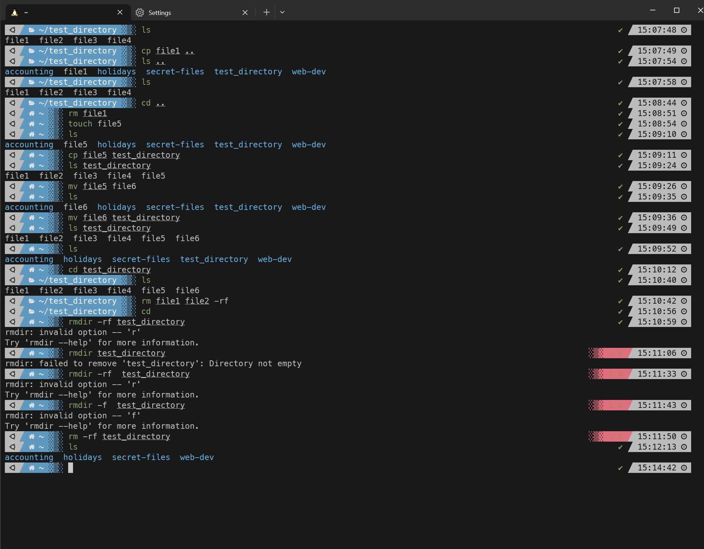

### Ticket: Copy, Move, and Delete Files Using `cp,` `mv,` and `rm.`

---

#### Summary

Learn how to copy, move, and delete files and directories using the `cp,` `mv,` and `rm` commands in a Unix-like operating system.

---

#### Description

- **Objective**: Understand and practice the basic file operations—copying, moving, and deleting—using the `cp,` `mv,` and `rm` commands.
  
- **Scope**: 
  - Basic usages of `cp,` `mv,` and `rm.`
  - How to utilize options and flags
  - Understanding potential risks and best practices

---

#### Learning Tasks

1. **Copy Files with `cp`**: 
  - Study the basic syntax and everyday use cases of the `cp` command.
  
2. **Move Files with `mv`**: 
  - Learn how the `mv` command moves files and directories.
  
3. **Delete Files with `rm`**: 
  - Understand how to safely use the `rm` command for file and directory removal.

4. **Explore Options and Flags**: 
  - Familiarize yourself with commonly used options like `-r` for recursive operations or `-f` for forcing actions.

5. **Best Practices and Warnings**: 
  - Be aware of the potential risks and learn how to use these commands responsibly.

6. **Troubleshooting**: 
  - Identify common issues you might encounter and learn how to resolve them.

---

#### Learning Goals

- Copy, move, and delete files and directories using the commands.
- Understand the implications of different options and flags.
- Safely perform all tasks without accidental data loss.

---

#### Priority

- Medium

***
### Answer

Below you will see I created a test directory with some dummy files to practice the cp, mv, and rm command. First I list out the files and copy file1 to my home directory. I create file5 in the home directory and copy it to the test directory. I then rename the file using mv command. The mv command is used to move and rename files. So I rename file5 to file6 and then move it to the test directory. I then use rm command to delete file1 and file2. I also tried the rmdir command which removes directories however it only removes empty directories and does not utilize the -rm flags. So I just used the rm -rf command to delete the whole directory with several files in it. This can be pretty dangerous and you want to exercise caution when using the -rf flags to delete stuff. You may accidentally delete something crucial.

