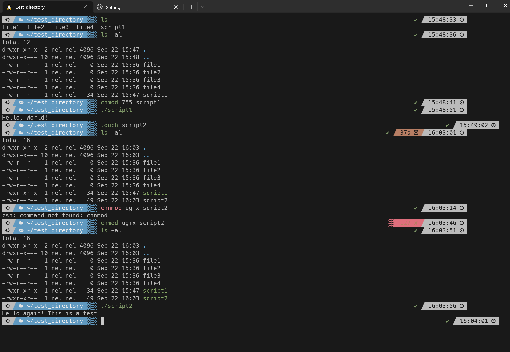
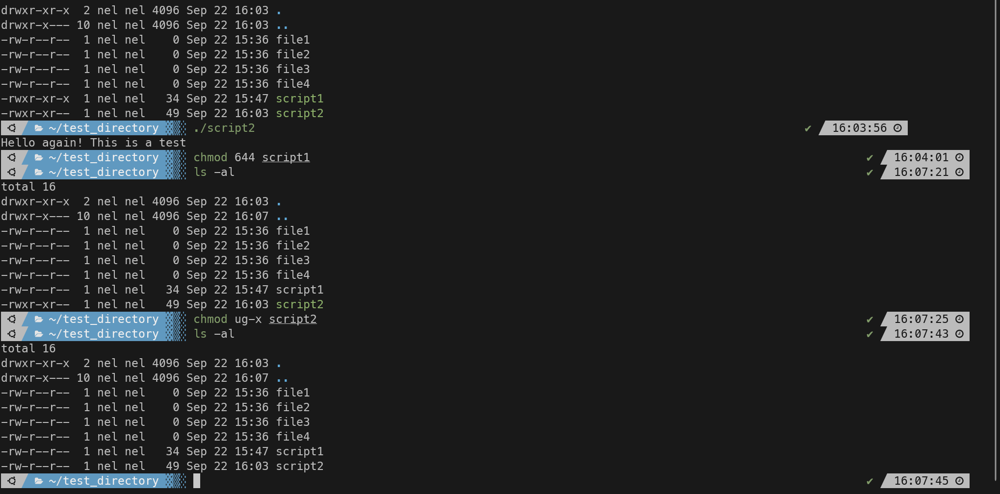

### Ticket: Understand and Modify File Permissions with `chmod`

---

#### Summary

Learn how to understand and modify file permissions using the `chmod` command in a Unix-like operating system.

---

#### Description

- **Objective**: Gain a comprehensive understanding of file permissions and how to modify them using the `chmod` command.
  
- **Scope**: 
  - Understanding file permission basics (Read, Write, Execute)
  - The syntax and primary usage of `chmod`
  - Different ways to specify permissions (numeric and symbolic modes)
  - Best practices and potential pitfalls

---

#### Learning Tasks

1. **File Permission Basics**: 
  - Learn about the three basic types of permissions: Read (`r`), Write (`w`), and Execute (`x`).
  
2. **Syntax and Basic Usage of `chmod`**: 
  - Understand the syntax and how to use `chmod` to change permissions on a file or directory.
  
3. **Specify Permissions**: 
  - Explore how to specify permissions using both numeric and symbolic modes.
  
4. **Best Practices and Warnings**: 
  - Familiarize yourself with the responsible use of `chmod,` including potential pitfalls and how to avoid them.

5. **Hands-on Practice**: 
  - Exercise 1: Create a text file and change its permissions to read-only.
  - Exercise 2: Create a script file and make it executable.
  - Exercise 3: Use symbolic mode to add write permission to a group for a specific file.
  - Exercise 4: Revert a file to its default permissions.
  
6. **Troubleshooting**: 
  - Discover common issues users may face while working with `chmod` and learn solutions for them.

---

#### Learning Goals

- Accurately read and set file permissions using `chmod.`
- Utilize both numeric and symbolic modes to specify permissions.
- Understand the importance and implications of different permissions.

---

#### Priority

- Medium

***
### Answer

Linux files are manage by the permissions read, write, and execute. These permissions are given to the owner of the file, the group that owns the file, and everyone else. 

Read indicates the user can read the file or directory which means they can cat the file or go into a directory (without read permission a user cannot go into a directory). Write is ability to append or create a file (within the directory) .

The execute permission indicates the user's ability to run the file. This is usually a script or application. 

The chmod command changes those permissions for the owner, group, and other. There are two ways to use it. The symbolic or numeric mode to modify permissions:

Symbolic allows you to use symbols and letters. For example chmod ug+rwx gives the owner and group read, write, and execute permissions. 

Numeric you only use number to specify permissions. It goes in this format: chmod 777, the first digit represents the owner, second is the group, third is everyone else. The permissions are represent by numerical value, read is 4, write is 2, and execute is 1. Those are then added up to represent the permission in numeric form. For example if the owner has read, write, and execute permissions then the value is 7. The group has read and write permissions which adds up to 6. The other only has read which is 4. This would represent chmod 764.

Below I go through the exercises to demonstrate these concepts. 

