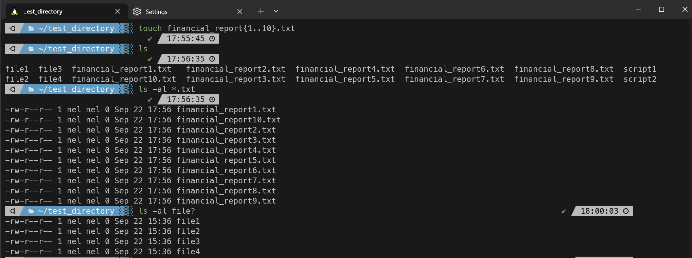
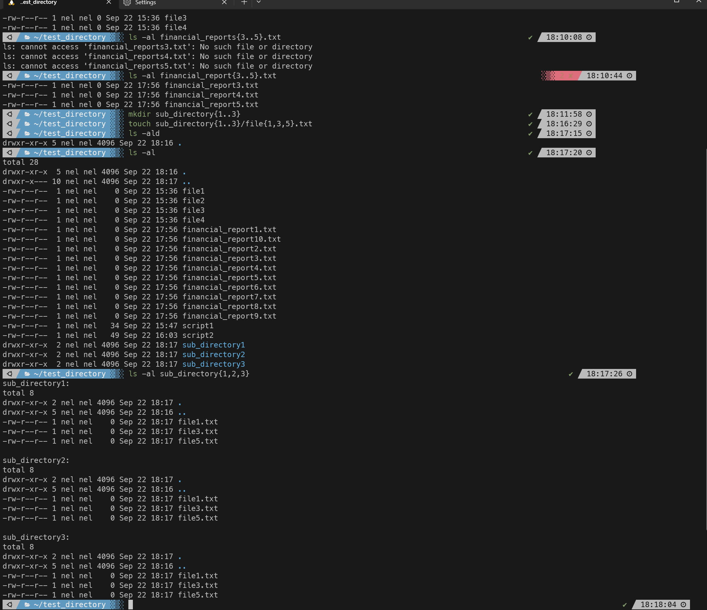

### Ticket: Utilize Wildcards in Commands

---

#### Summary

Learn how to utilize wildcards (`*,` `?`, `[...]`) in command-line commands for more flexible and efficient operations in a Unix-like operating system.

---

#### Description

- **Objective**: Understand the concept of wildcards in the command line and learn how to use them to perform various tasks more efficiently.
  
- **Scope**: 
  - Introduction to different types of wildcards (`*`, `?`, `[...]`)
  - How to use wildcards in common commands like `ls,` `cp,` `rm,` and more
  - Best practices and scenarios where wildcards are particularly useful
  - Pitfalls to avoid

---

#### Learning Tasks

1. **Introduction to Wildcards**: 
  - Learn about the basic types of wildcards and their functionality (`*,` `?`, `[...]`).
  
2. **Using Wildcards in Commands**: 
  - Understand how to use wildcards with common commands like `ls,` `cp,` `mv,` and `rm.`
  
3. **Best Practices**: 
  - Discover scenarios where using wildcards can save time and effort.
  
4. **Pitfalls to Avoid**: 
  - Learn the risks of using wildcards carelessly and how to mitigate them.

5. **Hands-on Practice**: 
  - Exercise 1: Use the `*` wildcard to list all `.txt` files in a directory.
  - Exercise 2: Utilize `?` to match single characters in file names.
  - Exercise 3: Employ `[...]` to list files that match specific character ranges.
  - Exercise 4: Combine wildcards to perform complex file operations.

6. **Troubleshooting**: 
  - Understand common issues one might encounter when using wildcards and how to resolve them.

---

#### Learning Goals

- Become proficient in using wildcards for various command-line tasks.
- Understand when and where to use different types of wildcards.
- Learn to use wildcards responsibly to avoid unwanted results.

---

#### Priority

- Medium

***
### Answer

Below I take advantage wildcards to do the following:

- create 10 files named financial_reports1 through 10 and I do it with a single command
- I use the ls command and use the * wildcard to only show files that end in .txt
- I use the ls command again search for files named file and end with a single character 
- I use the ls command again to search for financial_reports 3 through 5
- Using wildcards I create 3 directories and then make 3 files in each directory using the mkdir and touch commands in combination with wildcards, I then ls all 3 directories at once to show the files made.

