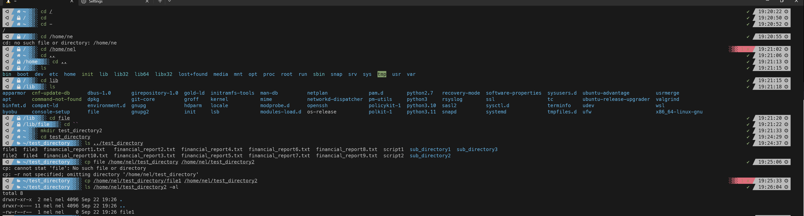

### Ticket: Describe What File Paths Are and How to Use Them

---

#### Summary

Learn the fundamentals of file paths in a Unix-like operating system and how to correctly navigate and specify them in various commands.

---

#### Description

- **Objective**: Understand file paths' concept, structure, and how they navigate the filesystem and specify locations for various operations.
  
- **Scope**: 
  - Types of file paths (Absolute vs. Relative)
  - Navigating file paths using commands like `cd,` `ls,` and more
  - Common symbols (`~`, `.`, `..`, `/`)
  - Best practices and potential pitfalls
  
---

#### Learning Tasks

1. **Types of File Paths**: 
  - Learn about absolute and relative paths and when to use each.
  
2. **Navigating File Paths**: 
  - Get hands-on experience with navigating directories using `cd` and inspecting them using `ls.`
  
3. **Common Symbols**: 
  - Understand the meaning of symbols like `~` for the home directory,. `` for the current directory, and `..` for the parent directory.
  
4. **Best Practices and Pitfalls**: 
  - Familiarize yourself with common best practices for specifying file paths and potential mistakes to avoid.

5. **Hands-on Practice**: 
  - Exercise 1: Navigate to your home directory using an absolute and a relative path.
  - Exercise 2: Use `..` and `` to move around directories.
  - Exercise 3: Create a directory and navigate it using a relative path.
  - Exercise 4: Use a full path to copy a file from one directory to another.
  
6. **Troubleshooting**: 
  - Learn to resolve common issues related to file paths, such as "No such file or directory."

---

#### Learning Goals

- Be able to navigate the filesystem using file paths confidently.
- Understand the difference between absolute and relative paths and when to use each.
- Gain proficiency in using common symbols for specifying paths.

---

#### Priority

- Medium

***
### Answer

Absolute paths is a specific path to a file or directory from the root directory of the file system. An example would /home/user1/reports. 

Relative paths specify a location of a file in relation to your current working directory. An example would be your in your home directory and you go into one of the directories inside which simple be `cd documents` which takes you into the documents directory in your home directory, if you wanted to go into a directory nested in documents then you would type `cd documents/reports`

/ is the root of any unix file structure, so `cd / ` will put you at the root level. 

To instantly move to your home directory, you can just type `cd ~`, the ~ indicates your home directory. You can also just type cd and hit enter, you'll go to your home directory

To move to the current directory's parent directory you can use `cd .. `. Think of it as going back one in the directory structure.

Below is screenshot of me going through the exercises

