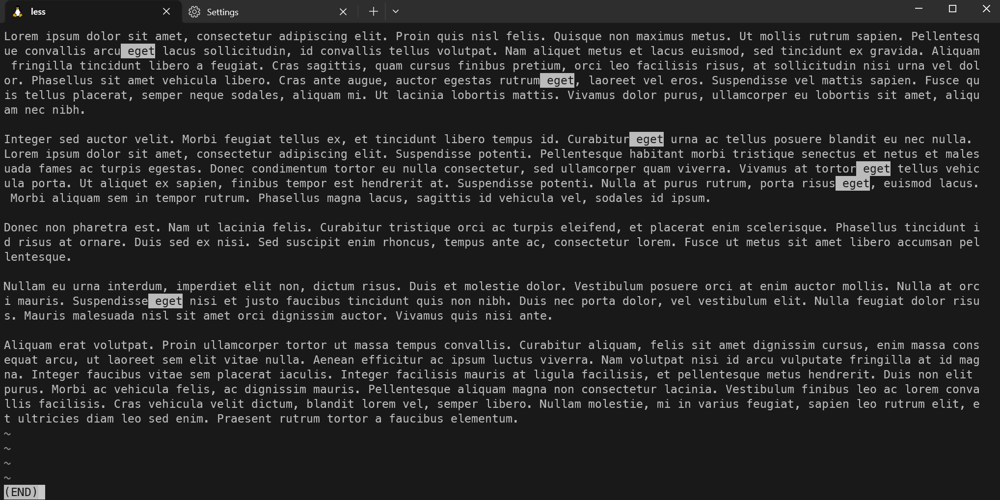

### Summary

Learn how to view the contents of large text files using command-line utilities like `cat,` `less,` and `more.` These utilities make navigating, searching, and reading files directly from the command line easier.

---

#### Description

- **Objective**: Understand how to efficiently view and navigate through large text files in a terminal using `cat,` `less,` and `more.`
  
- **Scope**: 
  - Introduction to `cat`
  - Introduction to `less`
  - Introduction to `more`
  
---

#### Learning Tasks

1. **Introduction to `cat`**: 
  - Learn what the `cat` command does and when it's most effective.
  
2. **Introduction to `less`**: 
  - Get to know the `less` command, its navigation features, and why it's useful for large files.
  
3. **Introduction to `more`**: 
  - Understand the `more` command and how it differs from `less.`
  
4. **Hands-on Practice**: 
  - Exercise 1: Use `cat` to display the content of a small text file and understand its limitations with large files.
  - Exercise 2: Open a large text file with `less` and practice navigation keys (`g` for top, `G` for bottom, `/` for search).
  - Exercise 3: Open the same large text file with `more` and notice the differences in navigation and features.
  - Exercise 4: Compare the speed and usability of `cat`, `less,` and `more` for large files.
  
5. **Troubleshooting**: 
  - Discuss common issues like terminal freezing or excessive memory usage when dealing with large files and how to mitigate them.

---

#### Learning Goals

- Gain a strong understanding of the utilities available for viewing large text files.
- Become proficient in navigating and searching within files using `less` and `more.`
- Understand the limitations of `cat` for large files and when to use each utility for optimal performance.

---

#### Priority

- Medium

***
### Answer

The cat command displays the contents of 1 or more text files directly to the terminal. It displays all the contents at once and has no navigation or scrolling. This makes unsuitable for long files. It does however do fine with small files. 

The more command is a command that allows you to view the contents of a text file but outputs in a manner that allows you to navigate the content. It supports using the space bar to view the next page and enter to view the next line. You can also press q to quit. Once all the content is parsed out you'll see the end on the last line. 

The less command is the most feature rich of the 3. It displays the output page by page allowing you to go back or forward. It also supports searching for text within the file using '/' followed by search terms. You can use the arrow keys, spacebar, and enter. This is the command you want to use for viewing your large files.

In the below screenshot I use the less command to output a text file and I also search for a word within file, that word is highlighted throughout the file.

