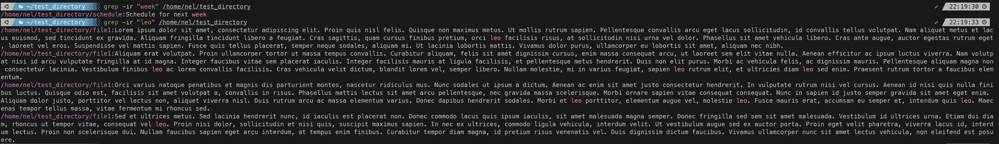
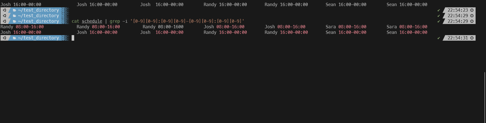

#### Summary

Learn to use `grep` for searching text within files. `grep` is a powerful command-line utility that lets you search through one or multiple text files for lines that match a regular expression pattern.

---

#### Description

- **Objective**: Master `grep` to search for specific text within a file, making it easier to analyze or filter data.
  
- **Scope**: 
  - Introduction to `grep`
  - Basic to advanced searching techniques with `grep`
  
---

#### Learning Tasks

1. **Introduction to `grep`**: 
  - Get familiar with' grep' and its basic syntax for searching text in files.
  
2. **Basic to Advanced Searching Techniques**: 
  - Learn to perform basic text searches and then move on to more advanced techniques like using regular expressions.
  
3. **Hands-on Practice**: 
  - Exercise 1: Use `grep` to search for a specific word in a text file.
  - Exercise 2: Use `grep` with flags to ignore case (`-i`) or to search recursively (`-r's).
  - Exercise 3: Perform a more complex search using regular expressions.
  - Exercise 4: Pipe the output of another command into `grep` to filter it.
  
4. **Troubleshooting**: 
  - Discuss common issues one might encounter when using `grep` and how to solve them.

---

#### Learning Goals

- Develop a thorough understanding of how `grep` works.
- Become proficient in using `grep` for various text-searching tasks.
- Understand the utility of `grep` in real-world scenarios like log analysis or data filtering.

---

#### Priority

- Medium

***
### Answer

grep is an incredibly powerful search tool available on unix systems. It is one of the most common tools used by system administrators, developers, and power users alike. It is used for searching text using regular expressions or just words. It is a versatile tool for searching text in files and is commonly used for tasks like log analysis, data extraction, and code searching. It's highly flexible due to its support for regular expressions, and it can be combined with other Unix commands for more advanced text processing.

Below I use grep with the -ir flags to ignore cases and search all files in the directory recursively

The screenshot below this I pipe the output cat into grep and search for the time format 08:00-09:00 using regular expressions

