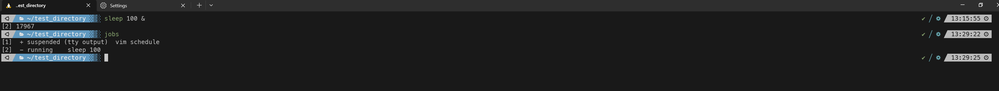
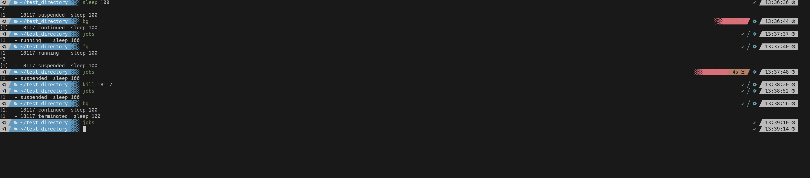

#### Summary

Master the essential job control commands like `bg,` `fg,` `jobs,` `kill,` and `Ctrl-Z` to manage running processes in your shell. These commands are essential for multitasking and system administration tasks.

---

#### Description

- **Objective**: Acquire the skills to manage and control background and foreground processes using basic job control commands.
  
- **Scope**: 
  - Introduction to job control
  - Understanding `bg,` `fg,` `jobs,` and `kill`
  - Practical use cases and examples
  
---

#### Learning Tasks

1. **Introduction to Job Control**: 
  - Learn what job control is and why it's important for multitasking and system administration.
  
2. **Understanding Job Control Commands**: 
  - Get familiar with the commands `bg`, `fg`, `jobs,` `kill,` and `Ctrl-Z,` including their syntax and usage.
  
3. **Practical Use-cases and Examples**: 
  - Walk through real-world examples to demonstrate how these commands are used for managing processes.
  
4. **Hands-on Practice**: 
  - Exercise 1: Use `Ctrl-Z` to pause a running process and put it in the background.
  - Exercise 2: List all background jobs using the `jobs` command.
  - Exercise 3: Bring a background job to the foreground using the `fg` command.
  - Exercise 4: Move a foreground job to the background using the `bg` command.
  - Exercise 5: Terminate a specific job using the `kill` command.
  
5. **Troubleshooting**: 
  - Discuss potential issues arising while using job control commands and how to resolve them.

---

#### Learning Goals

- Gain proficiency in managing and controlling shell processes using job control commands.
- Understand the fundamental aspects of job control for efficient multitasking and system administration.
- Master the practical application of these commands through hands-on exercises.

---

#### Priority

- Medium

***
### Answer

The commands bg and the shortcut Ctrl-z put processes in the background. Normally when you run a process on your terminal it will run it and not give your prompt back. Sometimes you want to run a process and do other things, that's where the Ctrl-z and bg command come in. These tools allow you to put processes in the background so you can have the terminal to do other stuff as well.

The jobs command will allow you to view all jobs that are running, stopped, or running in the background.

The fg command will bring processes in the background back to the terminal.

The kill command terminates a process manually. There are several flags you can use with it, kill -9 is the most famous example as this forcefully kills the process no exceptions. You will need the PID to use this command. 

Below I use the sleep command but I put it in the background by using the & at the end of the command

Below we start a process called sleep, I interupt the process with Ctrl-Z, I put it in the background with the bg command. I list it with the jobs command, I then bring it into the foreground with fg. I then use the kill command with the process ID.

