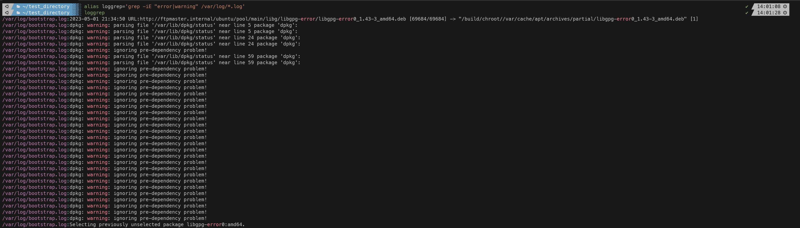
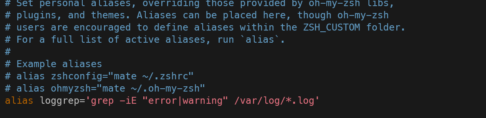
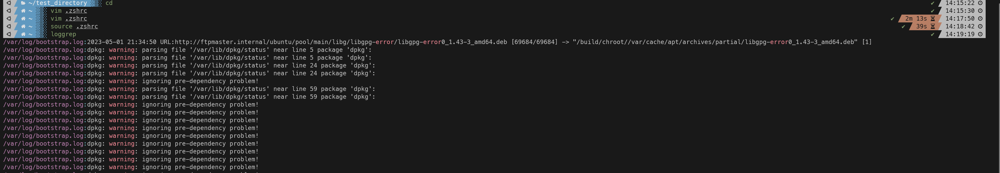

#### Summary

Learn how to create aliases for frequently used shell commands to enhance productivity and reduce repetitive typing. This task is crucial for anyone who spends much time in the shell environment.

---

#### Description

- **Objective**: Understand the concept of command aliases and learn how to create them to simplify complex or frequently used commands.
  
- **Scope**: 
  - What are aliases
  - How to create a simple alias
  - How to make an alias persistent across sessions
  
---

#### Learning Tasks

1. **What are Aliases**: 
  - Learn what aliases are and how they can make your command-line work more efficient.
  
2. **How to Create a Simple Alias**: 
  - Walk through the steps to create a temporary alias for a specific command using the `alias` command.
  
3. **How to Make an Alias Persistent**: 
  - Understand how to make your alias available across different shell sessions by adding it to your shell configuration file.
  
4. **Hands-on Practice**: 
  - Exercise 1: Create a temporary alias for a long or complex command you use frequently. For example, `alias ll='ls -l'`.
  - Exercise 2: Test your alias to ensure it behaves as expected.
  - Exercise 3: Make your alias persistent by adding it to your shell’s configuration file (e.g., `.bashrc,` `.zshrc`).
  - Exercise 4: Source your shell configuration file to apply the new alias without restarting it or opening a new shell to test it.
  
5. **Troubleshooting**: 
  - Discuss any issues arising while creating or using aliases and their potential solutions.

---

#### Learning Goals

- Understand the advantages of using aliases for frequently used or complex commands.
- Learn how to create, test, and make aliases persistent for long-term use.
- Become proficient in enhancing your command-line efficiency through the use of aliases.

---

#### Priority

- Medium

***
### Answer

Aliases are custom shortcuts that you can make for the CLI. They allow you to create your own shortcuts for commands that might be long for you to type out. In Unix systems aliases are typically defined and managed in the shell environment. You can make aliases permanent by adding the shortcuts to your shell's config file (.bashrc, .zshrc, etc).

An example would the alias l, which is the shortcut for the command 'ls -lah', so now the CLI all you have to type is l and the shell will interpret that as 'ls -lah'.

In the screenshot below I make an alias for the grep command. This grep commands searches for error or warning in all the files ending in .log in the /var/log directory. The alias is: alias loggrep='grep -iE "error|warning" /var/log/*.log' 

I now make the alias permanent by adding it to the .zshrc file and then sourcing the shell. 

Finally I apply the new alias without restarting or opening a new shell by sourcing.  I simply type source .zshrc and typed the alias to make sure it works as shown below

