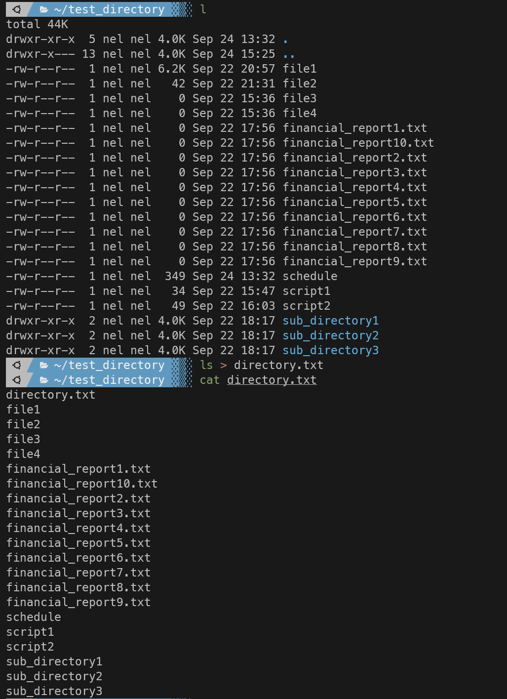
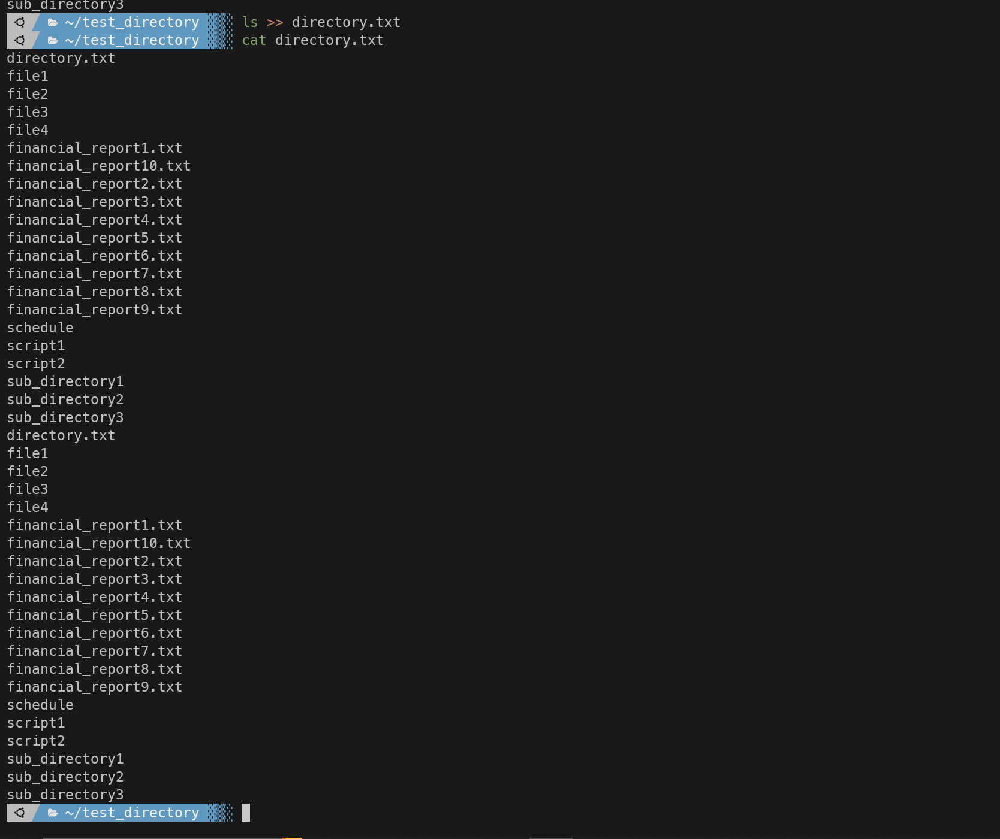
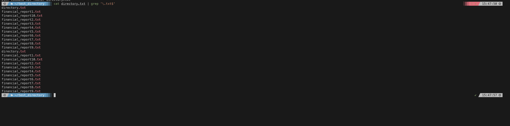

#### Summary

Learn how to redirect input and output in the shell using the `>`, `>>,` and `|` operators. Mastering these techniques allows you to manipulate how data flows between commands, files, and other I/O streams.

---

#### Description

- **Objective**: Get a firm grasp on the input/output redirection concept in the command line and become proficient in using `>,``>>,` and `|` for various tasks.
  
- **Scope**: 
  - Understanding I/O redirection
  - How to use `>` for overwriting
  - How to use `>>` for appending
  - How to use `|` for piping
  
---

#### Learning Tasks

1. **Understanding I/O Redirection**: 
  - Learn what I/O redirection is and why it is essential for efficient shell scripting and command-line use.
  
2. **How to Use `>` for Overwriting**: 
  - Understand how to use the `>` operator to redirect output from a command to a file, overwriting the file if it already exists.
  
3. **How to Use `>>` for Appending**: 
  - Learn how to use the `>>` operator to append output from a command to an existing file.
  
4. **How to Use `|` for Piping**: 
  - Learn how to use the pipe (`|`) operator to send the output of one command as the input to another.
  
4. **Hands-on Practice**: 
  - Exercise 1: Use the `>` operator to redirect the output of `ls` to a file, thereby saving the listing of a directory to that file.
  - Exercise 2: Utilize the `>>` operator to append the output of another `ls` command to the same file.
  - Exercise 3: Employ the `|` operator to pipe the output of `ls` into `grep` to filter the results.
  - Exercise 4: Combine multiple redirection operators in a single command line to perform complex tasks.
  
5. **Troubleshooting**: 
  - Go through common pitfalls and problems that might occur while redirecting I/O and how to solve them.

---

#### Learning Goals

- Acquire a strong understanding of I/O redirection and its practical use cases.
- Learn how to effectively use `>`, `>>`, and `|` to manipulate I/O streams.
- Gain hands-on experience using I/O redirection for file creation, modification, and data filtering tasks.

---

#### Priority

- Medium

***
### Answer

There are 3 redirects in unix systems:

- Standard input (stdin) and it has file descriptor number as 0
- Standard output(stdout) and it has file descriptor number as 1
- Standard error(stderr) and it has file descriptor number as 2

By default when running a command its output goes to the terminal. The output of a command can be routed to a file using the > symbol.

In the below screenshot we redirect the output of ls to a file name directory.txt using stdin and > as shown below:

You can use >> to direct output and append any file you direct it too. Using > will replace the text with whatever is redirected but using >> will just append it. As shown below:

Below we employ the | to redirect the output of ls into a grep command 

And finally we take a txt file grep the results to show only files that end in .txt and then append that do a different file:

