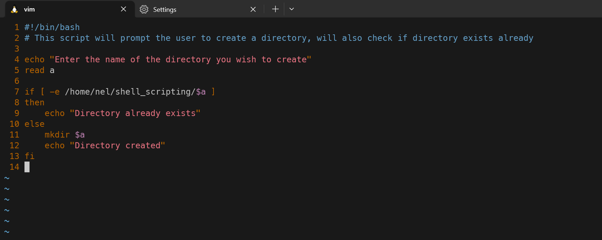
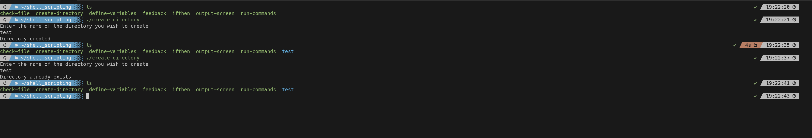

#### Summary

Learn how to write a simple shell script to automate a series of commands. This introduction will cover the basics of scripting, including variables, loops, and conditionals.

---

#### Description

- **Objective**: Acquire the skills to write a basic shell script that can automate tasks, use variables, and incorporate simple control structures like loops and conditionals.
  
- **Scope**: 
  - Introduction to shell scripting
  - Writing a basic script
  - Running a shell script
  
---

#### Learning Tasks

1. **Introduction to Shell Scripting**: 
  - Learn what a shell script is and how it can help automate repetitive tasks.
  
2. **Writing a Basic Script**: 
  - Understand the components of a shell script, including shebang, comments, variables, and commands.
  
3. **Running a Shell Script**: 
  - Learn how to give execute permission to the script and how to run it in the shell.
  
4. **Hands-on Practice**: 
  - Exercise 1: Create a new shell script file with a `.sh` extension. Add the shebang line at the top, `#!/bin/bash`.
  - Exercise 2: Write commands in the shell script to create a new directory and navigate into it.
  - Exercise 3: Use variables to store the directory name and echo a message.
  - Exercise 4: Add conditional statements to check if the directory already exists before creating it.
  - Exercise 5: Make the script executable using `chmod +x script_name.sh` and run it with `./script_name.sh`.
  
5. **Troubleshooting**: 
  - Discuss common issues that can arise while writing and running shell scripts and how to debug them.

---

#### Learning Goals

- Gain a fundamental understanding of shell scripts and why they are useful for automation.
- Learn to write a simple shell script incorporating variables, commands, and basic control structures.
- Become proficient in running shell scripts to automate tasks efficiently.

---

#### Priority

- Medium

***
### Answer

In the screen shots below I show the script I made described in the exercises and the script being used as well.

