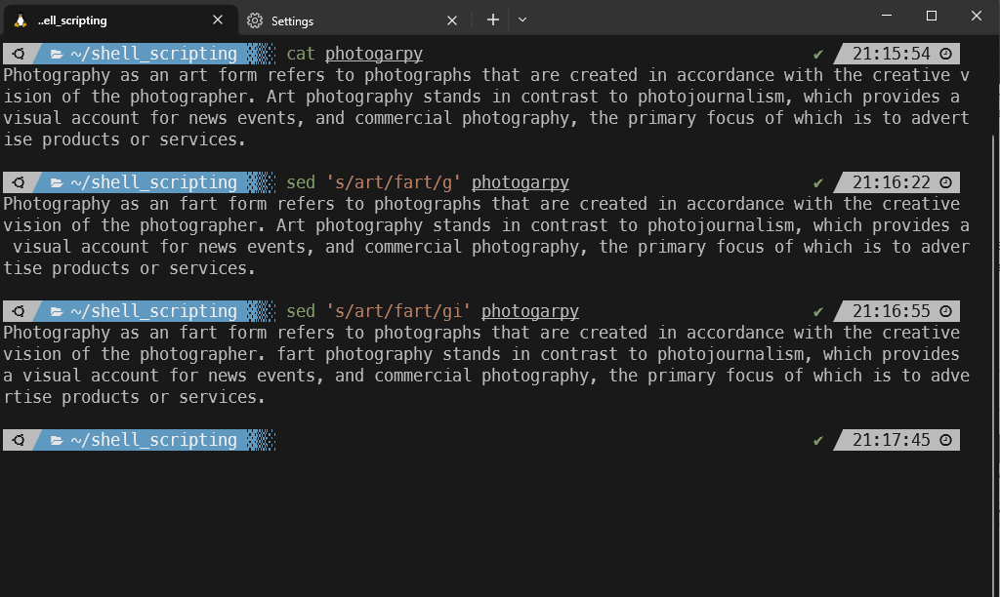
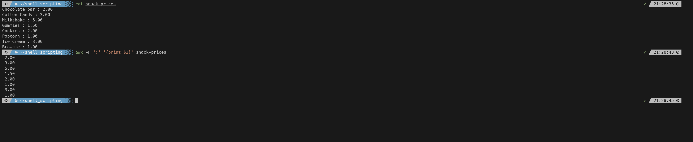
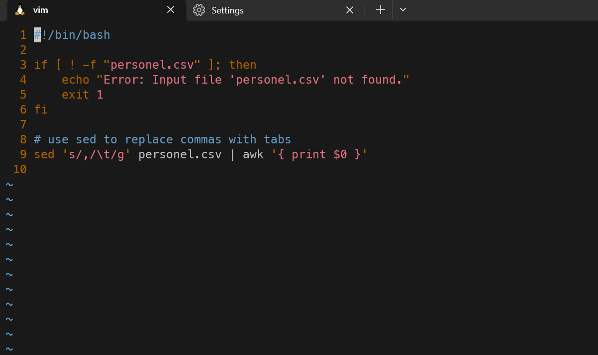
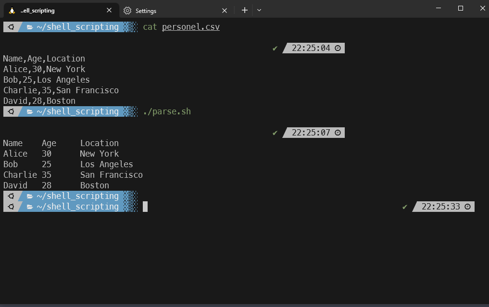

#### Summary

Learn to use `sed` and `awk` for text manipulation. These powerful utilities allow you to parse, transform, and manipulate text data from the command line and are particularly useful for scripting and data analysis.

---

#### Description

- **Objective**: Understand the capabilities of `sed` and `awk` for text manipulation tasks and become proficient in their usage.
  
- **Scope**: 
  - Introduction to `sed`
  - Introduction to `awk`
  - Text manipulation tasks using `sed`
  - Text manipulation tasks using `awk`
  
---

#### Learning Tasks

1. **Introduction to `sed`**: 
  - Get acquainted with what `sed` (Stream Editor) is and what kind of text manipulation tasks it can perform.
  
2. **Introduction to `awk`**: 
  - Learn what `awk` is and how it can be used for pattern scanning and processing in text files.
  
3. **Text Manipulation Tasks Using `sed`**: 
  - Understand how to perform basic text manipulation tasks like substitution, deletion, and more using `sed.`
  
4. **Text Manipulation Tasks Using `awk`**: 
  - Grasp how to manipulate text using `awk,` such as text filtering, field extraction, and calculations.
  
5. **Hands-on Practice**: 
  - Exercise 1: Use `sed` to replace all instances of a word in a text file.
  - Exercise 2: Use `awk` to print specific fields from a delimited text file.
  - Exercise 3: Combine `sed` and `awk` in a pipeline for more complex text manipulation.
  - Exercise 4: Write a small script that uses both `sed` and `awk` to automate a particular text manipulation task.
  
6. **Troubleshooting**: 
  - Go over common challenges you might encounter while using `sed` and `awk` and how to resolve them.

---

#### Learning Goals

- Develop a comprehensive understanding of text manipulation using `sed` and `awk.`
- Become proficient in using `sed` for stream editing tasks.
- Gain expertise using `awk` for text processing and data extraction.

---

#### Priority

- Medium

***
### Answer

sed is short stream editor, its a powerful command-line utility for text manipulations. It's often used for performing find-and-replace operations, text substitution, and basic text transformations.

In the below example I use sed on a small text file to replace the word 'art' for the word 'fart'. I also ignore case sensitive letters.

awk is a text-processing tool that allows you to perform various text manipulation tasks, such as searching for patterns, extracting specific columns, performing calculations, and more. It is commonly used on CSV files. 

In the below example I have a small file with snacks and their prices listed. I use the awk tool to separate the prices into their own column.

Below is a script that takes a csv file (personel.csv) and converts the commas into tabs and then prints out the contents in neat columns to make it more readable. The script uses awk & sed together.

