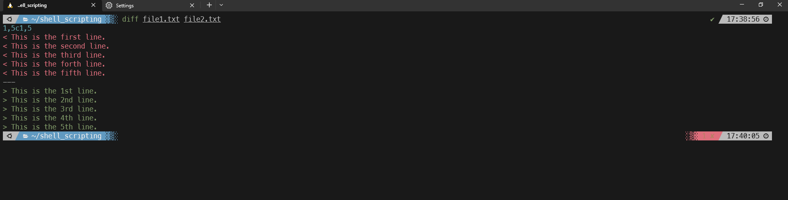
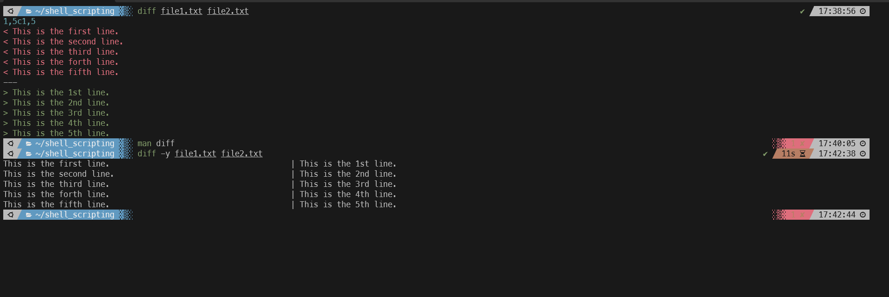
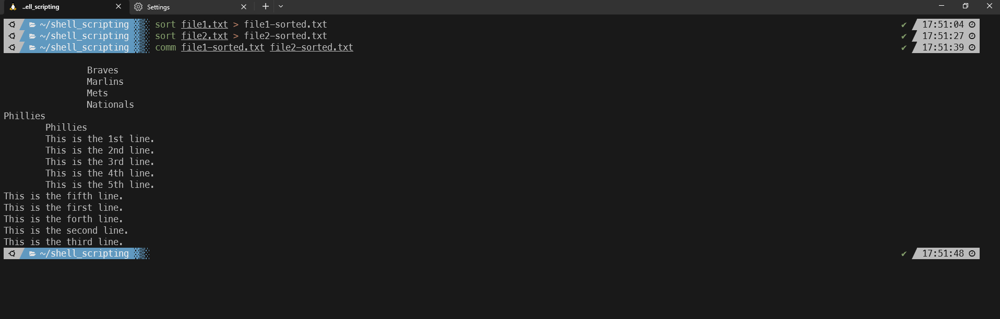

#### Summary

Learn how to compare the contents of two text files using the `diff` and `comm` commands. This is essential for debugging, version control, and understanding changes between file versions.

---

#### Description

- **Objective**: Understand the tools available for file comparison in the command line, specifically `diff` and `comm,` and learn how to use them effectively.
  
- **Scope**: 
  - Introduction to file comparison
  - How to use `diff`
  - How to use `comm`
  
---

#### Learning Tasks

1. **Introduction to File Comparison**: 
  - Understand why comparing files is important in debugging and version control tasks.
  
2. **How to Use `diff`**: 
  - Learn the basic syntax of `diff` and its standard options for comparing two files.
  
3. **How to Use `comm`**: 
  - Learn the basic syntax of `comm` and its standard options for comparing sorted files.
  
4. **Hands-on Practice**: 
  - Exercise 1: Create two text files with similar and different lines.
  - Exercise 2: Use `diff` to compare the two files and interpret the output.
  - Exercise 3: Sort the two files and then use `comm` to compare them, noting the differences and similarities.
  - Exercise 4: Use options with `diff` and `comm` to customize the comparison output.
  
5. **Troubleshooting**: 
  - Discuss common issues that may arise when using `diff` and `comm,` such as file format inconsistencies, and how to resolve them.

---

#### Learning Goals

- Understand the significance and utility of file comparison commands in various use cases.
- Learn how to use `diff` and `comm` to compare files effectively.
- Gain practical experience in file comparison for debugging and version control purposes.

---

#### Priority

- Medium

***
### Answer

The diff command is used to compare the contexts of two text files line by line and report the differences between. Mainly used to find differences between two files. 

Below we compare 2 different text files: 

The 1,5c1,5 indicates that there is a difference on line 1-5, which is true as every line in this file is different. You can also use the -y flag to make the comparison side by side though this isn't really scalable with larger files.

The comm command is used to compare two sorted text file line by line and produce a 3 column output: lines unique to the first file, lines unique to the second file, and lines common to both files.

In order for comm to work correctly both input files should be sorted. So proper use is to sort it with a command like sort before using the comm command. 

In the below example we use the sort command to sort the 2 text files we want to use with comm, they use comm with the sorted text files

