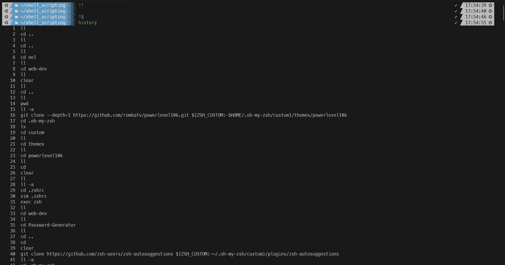
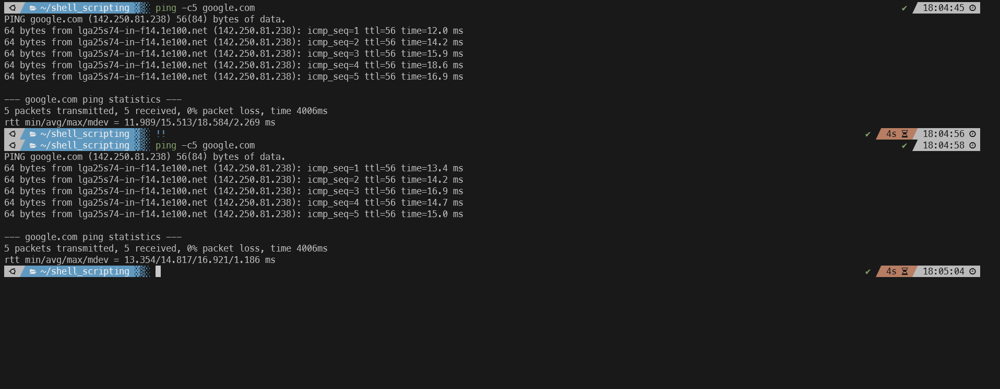
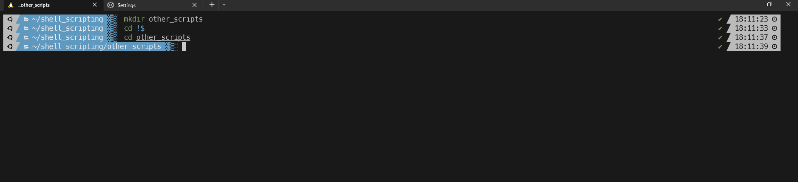

#### Summary

Learn how to effectively use the command history features in your shell for more efficient command-line operations. Topics will cover commands like `history`, `!!`, `!$`, and the use of the arrow keys to navigate through the command history.

---

#### Description

- **Objective**: Gain expertise in utilizing command history for quicker and more efficient command execution, debugging, and scripting.
  
- **Scope**: 
  - Overview of command history
  - Navigating through history
  - Reusing and modifying past commands
  
---

#### Learning Tasks

1. **Overview of Command History**: 
  - Understand what command history is and why it's beneficial for efficient shell operation.
  
2. **Navigating Through History**: 
  - Get familiar with using the up and down arrow keys and `history` command to navigate through previously used commands.
  
3. **Reusing and Modifying Past Commands**: 
  - Learn how to use `!!`, `!$`, and other shortcuts to quickly reuse or modify past commands for current tasks.
  
4. **Hands-on Practice**: 
  - Exercise 1: Use the arrow keys to cycle through your command history and execute a previously used command.
  - Exercise 2: Execute the last command again using `!!`.
  - Exercise 3: Reuse the last argument of the previous command with `!$`.
  - Exercise 4: Use the `history` command to display a list of your command history, then execute a command from that list.
  
5. **Troubleshooting**: 
  - Address common issues that might occur while navigating and reusing command history and how to resolve them.

---

#### Learning Goals

- Develop a strong understanding of how to utilize command history for improved shell efficiency.
- Master the techniques for reusing and modifying previous commands quickly and accurately.
- Acquire best practices for using command history for debugging and scripting tasks.

---

#### Priority

- Medium

***
### Answer

The history command is used to display a list of previously executed commands in the current shell session. You can simple hit the up arrow to go through previously entered commands one by one. You can also type history and it will display all the commands you used previously, note the amount of history stored can be changed in your config file. 

The !! command is a shortcut that represents the last command you executed in your shell session. It allows you to quickly rerun the previous command without typing it out again.

the !$ command represents the last argument of the previous command. It's useful when you want to reuse the last argument of a command in a new commands.

