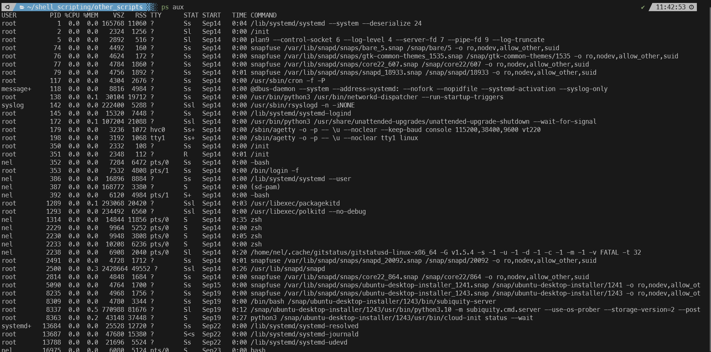
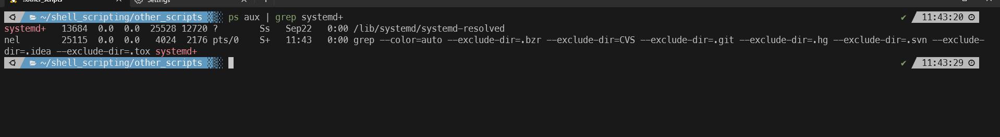

#### Summary

Learn how to monitor system processes and gain insights into your system's operation using the `ps` command. Process management is crucial for system administration, debugging, and performance tuning.

---

#### Description

- **Objective**: Become proficient in using the `ps` command to monitor, analyze, and manage system processes.
  
- **Scope**: 
  - Introduction to process management
  - Understanding the `ps` command
  - Interpreting `ps` output
  - Practical use cases and best practices
  
---

#### Learning Tasks

1. **Introduction to Process Management**: 
  - Understand what a process is and why monitoring processes is essential.
  
2. **Understanding the `ps` Command**: 
  - Learn about the `ps` command, syntax, and options for displaying process information.
  
3. **Interpreting `ps` Output**: 
  - Understand how to read and interpret the output of the `ps` command for insights into running processes.
  
4. **Practical Use-cases and Best Practices**: 
  - Explore scenarios where the `ps` command can be handy and learn best practices for its usage.
  
5. **Hands-on Practice**: 
  - Exercise 1: Use `ps` to list all processes running for the current user.
  - Exercise 2: Use `ps` with flags like `-e,` `-f,` or `-l` to display extended process information.
  - Exercise 3: Identify a specific running process by its name or ID using `ps` and `grep.`
  
6. **Troubleshooting**: 
  - Examine common issues that may arise while using `ps` and how to resolve them.

---

#### Learning Goals

- Master the ability to monitor and analyze system processes using the `ps` command.
- Understand the critical aspects of process management and how to interpret `ps` output for system insights.
- Apply best practices for using `ps` in different debugging and performance tuning scenarios.

---

#### Priority

- Medium

***
### Answer

The ps command is used to provide info about the currently running processes in the operating system. It gives you snapshot view of active processes on your system.

Below we us the command `ps aux` to display all running processes and then we pipe the command and grep systemd+ to look up that process:

