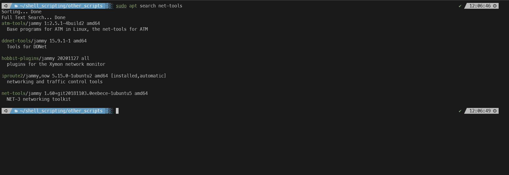
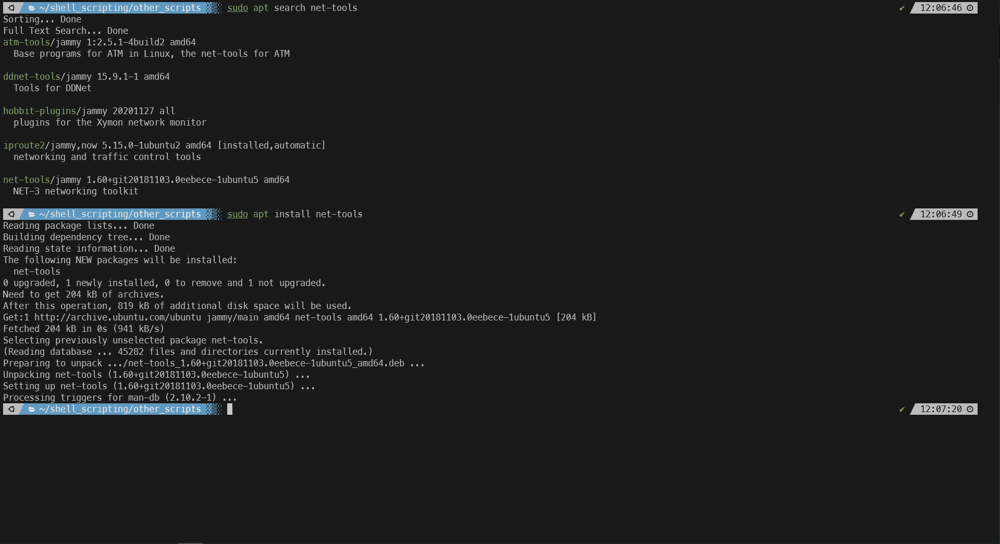
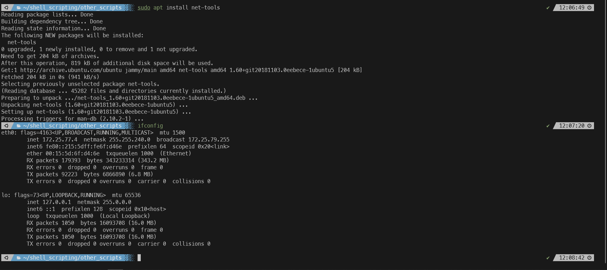

#### Summary

Learn the basics of package management by installing a software package using `apt` on a Debian-based system or `brew` on a macOS system. This skill is essential for managing software and libraries on Unix-like operating systems.

---

#### Description

- **Objective**: Gain proficiency in using package managers (`apt` or `brew`) to install, update, and manage software packages on your operating system.
  
- **Scope**: 
  - Introduction to package management
  - Understanding `apt` and `brew`
  - Installing a package
  - Verifying installation
  
---

#### Learning Tasks

1. **Introduction to Package Management**: 
  - Learn what package management is and why it's crucial for software maintenance.
  
2. **Understanding `apt` and `brew`**: 
  - Briefly explore what `apt` and `brew` are and how they differ regarding usage and features.
  
3. **Installing a Package**: 
  - Walk through the steps to install a software package using `apt` or `brew.`
  
4. **Verifying Installation**: 
  - Learn how to verify that a package has been successfully installed.
  
5. **Hands-on Practice**: 
  - Exercise 1: Use `apt` or `brew` to search for a package (e.g., `git` or `curl`).
  - Exercise 2: Install the chosen package using `apt install <package-name>` or `brew install <package-name>.`
  - Exercise 3: Verify the installation by running a command related to the installed package (e.g., `git --version`).
  
6. **Troubleshooting**: 
  - Discuss common issues that might occur during package installation and how to resolve them.

---

#### Learning Goals

- Understand the fundamentals of package management in Unix-like operating systems.
- Become proficient in installing and verifying software packages using `apt` or `brew.`
- Learn to troubleshoot common issues that can arise during the package installation process.

---

#### Priority

- Medium

***
### Answer

The apt (Advanced Package Tool) is a package management system used in Debian-based linux distributions (ubuntu, mint, etc). APT simplifies the process of installing, upgrading, configuring, and removing software packages on your system. It also manages software repositories where packages are stored and retrieved.

Below we use apt to search for the net-tools package, we install it, then we run the ifconfig command that's part of the package to verify installation.

 