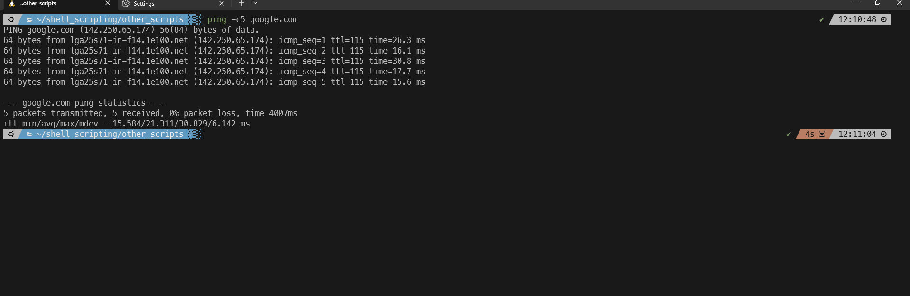

#### Summary

Learn how to use the `ping` command to check network connectivity between your local machine and another network device or website. Understand how `ping` works and how to interpret its output for basic network troubleshooting.

---

#### Description

- **Objective**: Acquire the skills to use `ping` to check network connectivity, diagnose network issues, and understand latency.
  
- **Scope**: 
  - Basic usage of `ping`
  - Understanding `ping` output
  - Practical use cases and best practices
  
---

#### Learning Tasks

1. **Understanding `ping`**: 
  - Learn what `ping` is, how it works, and why it is used for network diagnostics.
  
2. **Basic Usage of `ping`**: 
  - Get familiar with the syntax of the `ping` command and its primary usage for checking connectivity to a domain or IP address.
  
3. **Understanding `ping` Output**: 
  - Understand how to interpret the output of `ping,` including latency and packet loss.
  
4. **Practical Use-cases and Best Practices**: 
  - Discuss common scenarios where `ping` is helpful and best practices for its usage.
  
5. **Hands-on Practice**: 
  - Exercise 1: Use `ping` to check connectivity to a well-known website like `www.google.com.`
  - Exercise 2: Use `ping` with an IP address to diagnose connectivity.
  - Exercise 3: Interpret the output of a `ping` command to identify latency and packet loss.
  
6. **Troubleshooting**: 
  - Explore common issues you might encounter while using `ping` and their solutions.

---

#### Learning Goals

- Master the ability to check network connectivity using `ping.`
- Understand how to interpret the output of a `ping` command for troubleshooting purposes.
- Apply best practices for using `ping` in various networking scenarios.

---

#### Priority

- Medium

***
### Answer

The ping command is a network utility that comes with most unix and linux systems. It is used to test the reach ability of the host (a PC or server). It measures the round-trip time it takes for data packets to travel from the source to the destination host and back.

If you can reach a website, a certain server, or are having connectivity issues in general the first thing any IT person would do is use the ping command to test the connection. The ping command is the most common tool used to diagnose network connectivity.

Below we use the ping -c5 command on google.com to test the network reachability. The ping command will send 5 packets to the google.com domain and test to see if these packets get to google.com and come back. the -c flag lets you indicate how many packets you want to send, if you don't use the -c flag it will continue indefinitely until you manually stop it.

These results indicate that the connection is fine with 0% packet lose. 