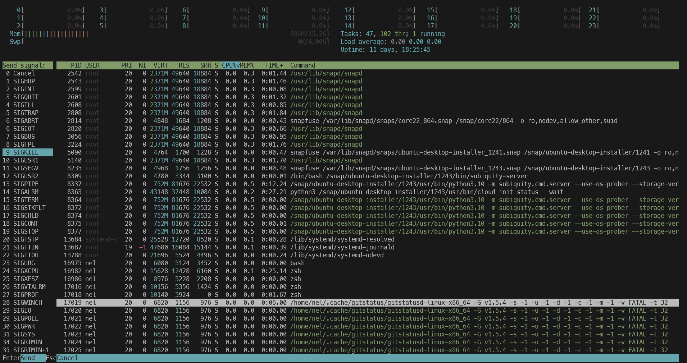

#### Summary

Learn how to monitor system health in real-time using `top` and `htop` on a Unix-like operating system. Gain insights into CPU, memory usage, running processes, and other system metrics.

---

#### Description

- **Objective**: Acquire the skills to effectively monitor system health, resources, and performance using `top` and `htop.`
  
- **Scope**: 
  - Introduction to `top` and `htop`
  - Key metrics displayed (CPU usage, memory, processes, etc.)
  - Using various flags and options for detailed views
  - Best practices for system monitoring
  
---

#### Learning Tasks

1. **Introduction to `top` and `htop`**: 
  - Learn the basics of `top` and `htop` and how they differ.
  
2. **Key Metrics**: 
  - Understand the key metrics displayed in both utilities, such as CPU usage, memory, running processes, and load averages.
  
3. **Using Flags and Options**: 
  - Familiarize yourself with various flags and options for sorting, filtering, and getting detailed views.
  
4. **Best Practices**: 
  - Dive into the best practices for effective real-time system monitoring.
  
5. **Hands-on Practice**: 
  - Exercise 1: Open `top` and identify the top 5 CPU-consuming processes.
  - Exercise 2: Use `htop` to sort processes by memory usage.
  - Exercise 3: Use flags in `top` to show only specific metrics.
  - Exercise 4: Use `htop` to kill a specific process.
  
6. **Troubleshooting**: 
  - Cover common issues that might occur while using `top` and `htop` and how to resolve them.

---

#### Learning Goals

- Develop the ability to monitor system health and performance effectively.
- To diagnose system issues, utilize the `top` and `htop` features.
- Implement best practices in real-time system monitoring.

---

#### Priority

- Medium

***
### Answer

The top & htop commands are used for monitoring system processes and resource usage in a Unix-like operating system. the `htop` command is an improved and more user friendly version of `top` with additional features and an interactive interface. 

Below we use top to identify the top 5 CPU-consuming processes, the `top` command automatically show the top 5 CPU-consuming processes for all cores. It updates in real time. 

Below we use htop to sort the process by memory. htop displays process by CPU usage by default so when htop is running you press f6 which opens the sortby menu, you then use the arrow keys to select the "PERCENT_MEM" option. htop will then sort processes by memory usage

Below we use top to do the same thing (sort processes by MEM) by using the -o to specify we want to sort by a different parameter (in this case memory) and the -n to select how many times we want to update the display (in this case 10)

Below we use htop to kill a process, when htop is running simply use the arrow keys to select the specific process you want, press F9 which will open a menus to select which signal you want to send the process, at which point you can send a SIGKILL to that process to kill it.

