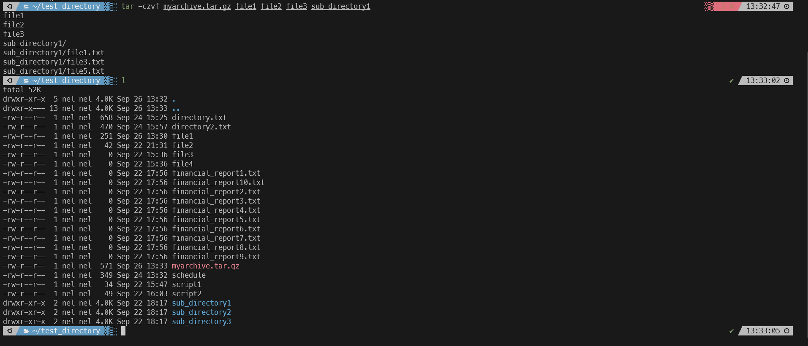
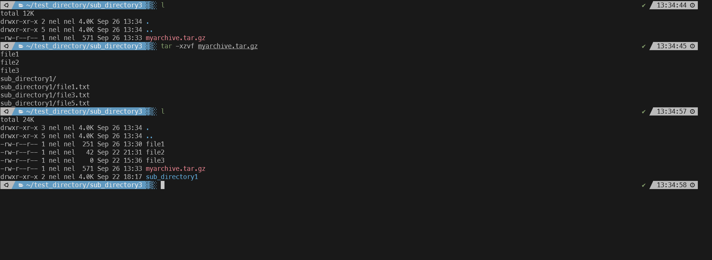

#### Summary

Learn how to compress and decompress files using various utilities like `tar,` `gzip,` `zip,` and `unzip` on a Unix-like operating system.

---

#### Description

- **Objective**: Master the techniques for compressing and decompressing files to save disk space and facilitate easier file transfers.
  
- **Scope**: 
  - Compressing files using `gzip` and `zip`
  - Decompressing files using `gunzip` and `unzip`
  - Creating compressed archives with `tar`
  - Best practices and use cases
  
---

#### Learning Tasks

1. **Compressing Files**: 
  - Learn how to use `gzip` and `zip` to compress individual files or directories.
  
2. **Decompressing Files**: 
  - Get acquainted with `gunzip` and `unzip` for decompressing files back to their original state.
  
3. **Archiving with `tar`**: 
  - Understand how to create compressed archives using the `tar` command and various flags.
  
4. **Best Practices**: 
  - Discover the best practices for compression and decompression, like choosing formats and checking integrity.
  
5. **Hands-on Practice**: 
  - Exercise 1: Compress a single file using `gzip.`
  - Exercise 2: Decompress the file you compressed in Exercise 1 using `gunzip.`
  - Exercise 3: Create a compressed archive using `tar` with multiple files.
  - Exercise 4: Extract the files from the compressed archive created in Exercise 3.
  
6. **Troubleshooting**: 
  - Address common issues you might face during compression and decompression and learn how to resolve them.

---

#### Learning Goals

- Become proficient in file compression and decompression using various utilities.
- Understand the purpose and advantage of different compression formats.
- Be able to create and extract compressed archives.

---

#### Priority

- Medium

***
### Answer

gzip and zip are compression utilities used to compress and decompress files and directories in Unix-like operating systems.

Here we compress and decompress a file using gzip. Notice the file is now much smaller after compression.

Below we use the tar command and create a compressed archive using gzip. 

Below we extract that archive we just created into a new directory

