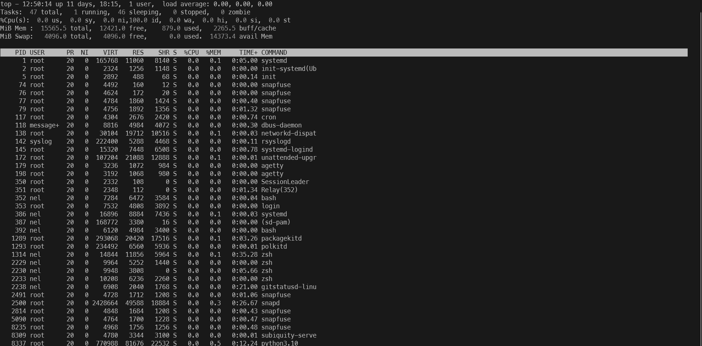

### Ticket: Get System Information Using Various Commands

---

#### Summary

Learn how to use various commands to retrieve system information on a Unix-like operating system. Get insights into CPU, memory usage, disk space, and other system metrics.

---

#### Description

- **Objective**: Acquire skills to fetch different types of system information using command-line tools.
  
- **Scope**: 
  - Basic commands like `uname,` `df,` `free,` and `top.`
  - More advanced tools like `htop,` `lscpu,` and `lsmem.`
  - Interpretation of the output
  - Best practices and use cases
  
---

#### Learning Tasks

1. **Basic System Information**: 
  - Learn to use `uname` for getting basic system information like OS type, kernel version, etc.
  
2. **Disk Usage**: 
  - Understand how to check disk usage using the `df` command.
  
3. **Memory Usage**: 
  - Get familiar with the `free` command for memory-related information.
  
4. **Real-time Metrics**: 
  - Introduce yourself to `top` for real-time system metrics.
  
5. **Advanced Tools**: 
  - Dive into more detailed metrics using advanced tools like `htop,` `lscpu,` and `lsmem.`
  
6. **Interpreting Output**: 
  - Learn how to read and interpret the output from these commands.
  
7. **Hands-on Practice**: 
  - Exercise 1: Use `uname` to discover the kernel version.
  - Exercise 2: Check disk space using `df` and interpret the output.
  - Exercise 3: Run `free` to view available memory and swap space.
  - Exercise 4: Open `top` and identify the most CPU-intensive process.
  
8. **Troubleshooting**: 
  - Explore common issues that might arise and how to troubleshoot them.

---

#### Learning Goals

- Fetch and interpret essential system information using a variety of commands.
- Understand where and how to use different tools for different metrics.
- Interpret system metrics to make informed decisions.

---

#### Priority

- Medium

***
### Answer

The uname command is used to print system information like the hostname, the hardware platform, the kernel, etc.

Below we use uname with the -a & -r flags to identify the kernel version

Below we use the `df -h --total` command to display the diskspace in human readable format. We can interpret we have a little over 7 gigs of space dedicated to our WSL install. 

Below we use the free command to view available space and memory swap space. We use the -g flag to display the memory in gigabytes. The screenshot below shows us that we can 12G of memory and 4G of swap space.

By default the top command will display the top 5 CPU-consuming processes so you just simply run the top command and look at the top 5 processes listed.

