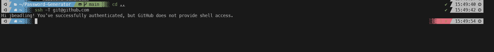

#### Summary

Learn how to securely connect your local machine to your GitHub account using SSH (Secure Shell). Understand the advantages of SSH over HTTPS for repository operations like clone, push, and pull.

---

#### Description

- **Objective**: Master the steps required to set up and use SSH for connecting to GitHub, eliminating the need to enter your username and password for each interaction.
  
- **Scope**: 
  - Generating SSH keys
  - Adding the SSH key to the SSH-agent
  - Associating the SSH key with your GitHub account
  - Testing the SSH connection
  
---

#### Learning Tasks

1. **Understanding SSH and GitHub**: 
  - Learn why SSH is beneficial for secure and convenient interactions with GitHub.

2. **Generating SSH Keys**: 
  - Use the `ssh-keygen` command to generate an SSH key pair.
  
3. **Adding SSH Key to SSH-Agent**: 
  - Learn how to add your generated SSH key to the SSH-agent for easy management.
  
4. **Associating SSH Key with GitHub**: 
  - Navigate through GitHub settings to add your SSH public key, enabling SSH-based interactions.
  
5. **Testing the Connection**: 
  - Perform a test to ensure the SSH connection to GitHub is properly set up.
  
6. **Hands-on Practice**: 
  - Exercise 1: Generate an SSH key pair.
  - Exercise 2: Add the generated SSH key to your SSH-agent.
  - Exercise 3: Associate the SSH public key with your GitHub account.
  - Exercise 4: Test the SSH connection to GitHub with `ssh -T git@github.com.`
  
7. **Troubleshooting**: 
  - Discuss common issues that might arise when setting up SSH for GitHub and learn how to resolve them.

---

#### Learning Goals

- Become proficient in setting up and using SSH for GitHub interactions.
- Understand the benefits and security advantages of using SSH over HTTPS for GitHub.
- Successfully test and confirm that SSH-based interactions with GitHub are correctly configured.

---

#### Priority

- Medium

***
### Answer

I followed the exercises and created an SSH key pair, added it to my SSH-agent, I associated those keys with my GitHub account, and then I test my SSH connection to GitHub with the `ssh -T git@github.com` command

