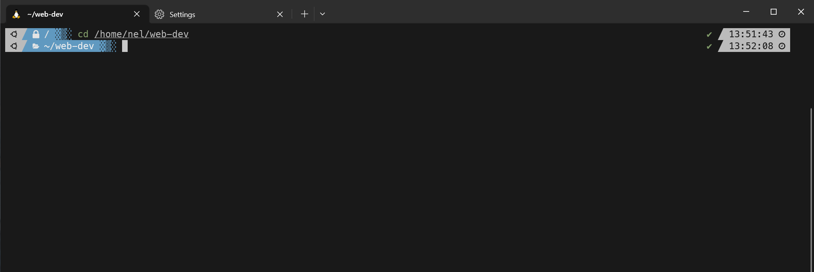
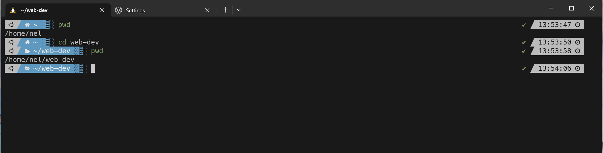
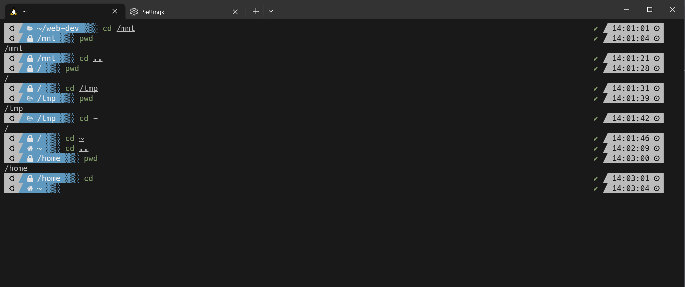

### Ticket: Navigate to Different Directories Using `cd`

---

#### Summary

Create a guide or tutorial demonstrating how to navigate different directories using the `cd` command in the command-line interface.

---

#### Description

- **Objective**: To educate users on effectively using the `cd` command for directory navigation in a Unix-like operating system.
  
- **Scope**: 
  - Basic usage of `cd`
  - Advanced options and flags
  - Common use cases and scenarios
  - Troubleshooting common issues

---

#### Tasks

1. **Basic Usage**: 
  - Explain the simplest form of `cd` and how it works.
  
2. **Advanced Options**: 
  - Cover any flags or options that can be used with `cd.`
  
3. **Common Scenarios**: 
  - Demonstrate how to navigate to parent directories and home directories using relative vs. absolute paths.

4. **Troubleshooting**: 
  - List common issues users might face and how to solve them.

5. **Compile Information**: 
  - Create a guide or tutorial that encapsulates all the above information.

---

#### Acceptance Criteria

- A well-structured guide or tutorial that covers all the listed tasks.
- Include examples and screenshots where applicable.
- Factual accuracy is essential.

---

#### Priority

- Medium

***
### Answer

The cd command is used to change the working directory. Simply type cd along with the directory you want to move into. You can also type very specific paths and jump through several directories straight into the one you want. This is known as using relative paths. As shown below:

Here I typed out the entire path from the root till the end.

You can also use a relative path which involves specifying the location of a file or directory in relation to your working directory. As shown below:

Here I navigated to the web-dev directory from my home directory. I only had to specify the we-dev directory to move into it. Unlike the previous example where I specified from root.

Some common flags to use with cd:

- [cd ~ ] will take you to your home directory no matter where you are 
- [cd - ] will take you to the previous directory you were in
- [cd .. ] will take you to the directories parent directory
- [cd] if you just type cd and enter it will also take you to your home directory

demonstrated below:  

The most common issues is getting lost in the CLI, the best way to fix that is the use the pwd command. This will print out the working directory you are currently in. Anytime you are not sure simply type pwd and it will show you the absolute path you are in. As shown above. 