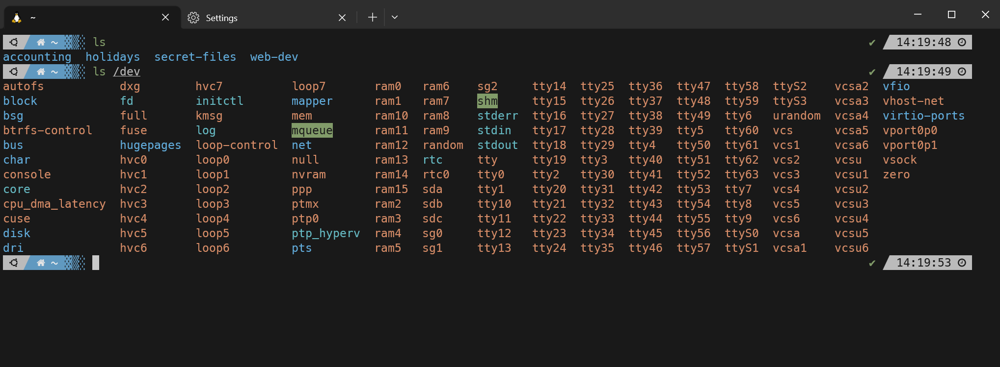
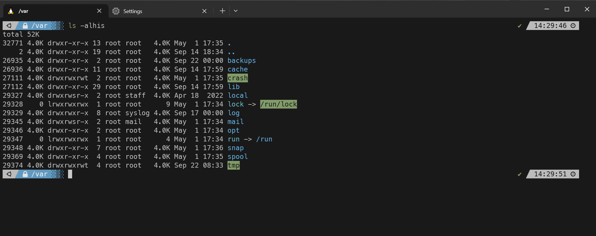
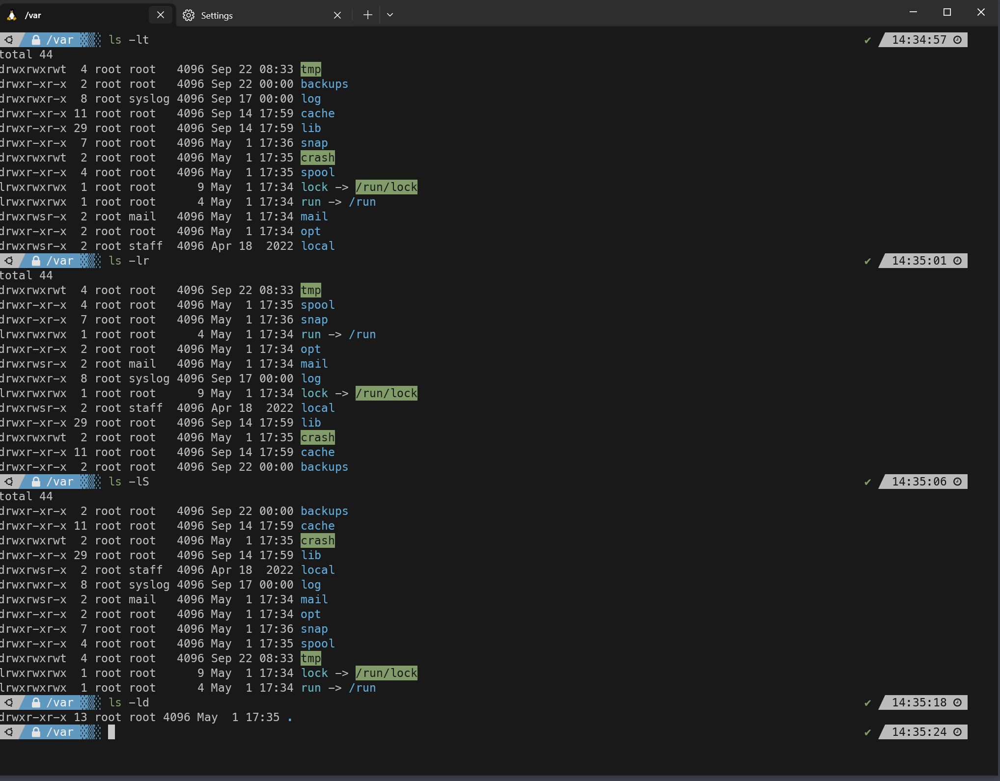

### Ticket: List Directory Contents with `ls`

---

#### Summary

Develop a guide or tutorial to educate users on how to list directory contents using the `ls` command in a Unix-like operating system.

---

#### Description

- **Objective**: Provide a comprehensive understanding of the `ls` command, focusing on various options and use cases.
  
- **Scope**: 
  - Basic `ls` command usage
  - Common options and flags
  - Use cases for sorting, filtering, and displaying additional information
  - Troubleshooting

---

#### Tasks

1. **Basic Usage**: 
  - Describe the basic functionality of the `ls` command and its most straightforward use cases.
  
2. **Common Options**: 
  - Explain their purposes and benefits by exploring commonly used flags such as `-l,` `-a`, `-h,` etc.

3. **Sorting and Filtering**: 
  - Show how to use `ls` to sort files by date, name, or other attributes and filter files based on specific criteria.
  
4. **Additional Information**: 
  - Explain how to display additional file details like permissions, date modified, and more.

5. **Troubleshooting**: 
  - Address common issues users may encounter while using `ls` and provide solutions.

6. **Compile Information**: 
  - Create a well-organized guide or tutorial incorporating all the above points.

---

#### Acceptance Criteria

- A clear and informative guide or tutorial with examples, even screenshots, to aid understanding.
- All information must be factual and accurate.

---

#### Priority

- Medium

***
### Answer

The [ls] command is used to list all information about the files and directories (which are also files) currently in the directory. By default it will list everything in the directory you are in but you also specify a directory like so [ls /home/user/accounting].

Above we show the default ls which just lists everything in the current directory then we specify a directory for the ls command

Like any command ls has lots of flags to use. Some of the more common ones are:

- [ -l ] uses a long listing format
- [ -a ] this will list hidden files (hidden files a preceded with a . )
- [ -h ] this will print file sizes in format like 1k, 234M, 2G, etc
- [ -i ] this will list the node number 

You can combine all of these options to make an ls command that displays alot of info on the files in a decently readable format.

Here you can see we combine multiple flags to show us as much info as possible. The node number, the permissions, the owner and group owner, the size, and last date it was edited. You'll also notice it lists it in alphabetical order. The -l flag automatically lists them in order.

If you wish to sort date you can use the -t flag

If you wish to sort by reverse order use the -r flag

If you wish to sort by file size, use the -S flag

If you wish to list only directories use the -d flag

These examples are demonstrated below:

